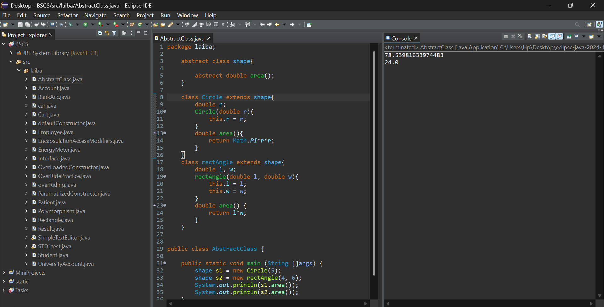

🟢 Java Abstract Shapes – OOP Demonstration

Today I studied some important Object-Oriented Programming (OOP) concepts in Java and implemented a simple task to practice them.

This project demonstrates Abstraction, Inheritance, and Polymorphism using an abstract class.

📚 What I Learned Today

✅ Abstract Classes

✅ Method Overriding

✅ Inheritance

✅ Runtime Polymorphism

✅ Clean OOP Structure

After understanding these concepts, I performed a small task to calculate the area of different shapes using abstraction.

📂 Project Description

An abstract class shape contains an abstract method:

abstract double area();

Two classes extend it:

Circle → Calculates area using formula: π × r²

rectAngle → Calculates area using formula: length × width

In the main method, polymorphism is demonstrated by creating references of type shape.

This small project helped me understand how abstraction works in real coding practice 💡

🖥️ Screenshot of Output

🚀 How to Run

Clone the repository

Open in any Java IDE (Eclipse, IntelliJ, VS Code)

Run AbstractClass.java

🌱 Learning Journey

I am continuously improving my Java and OOP skills.
Every small project is a step toward becoming a better developer 💻✨

👩‍💻 Author

Laiba Azeem
Computer Science Student
Passionate about learning and building 💙
